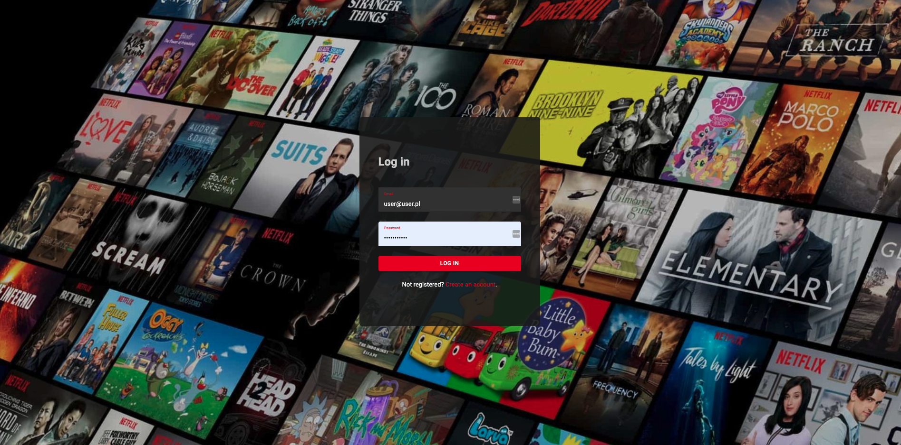
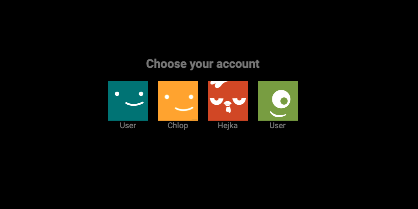
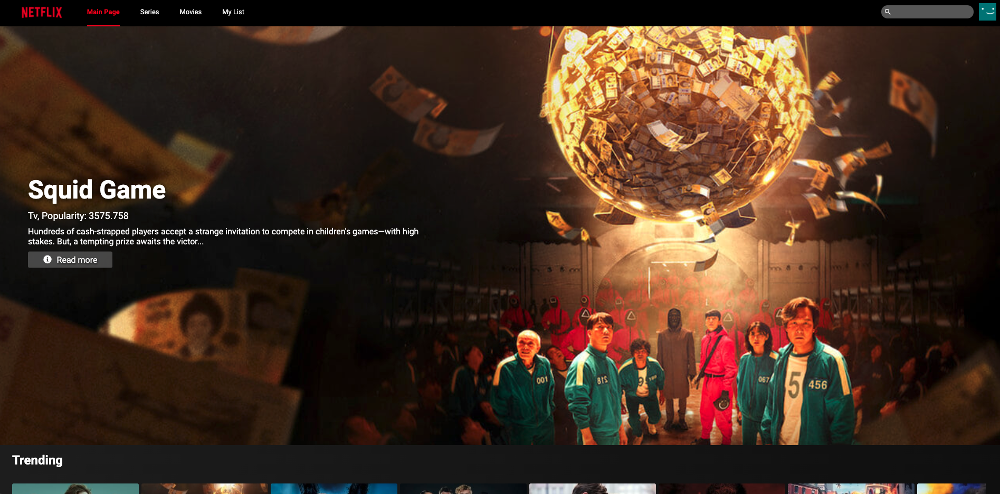
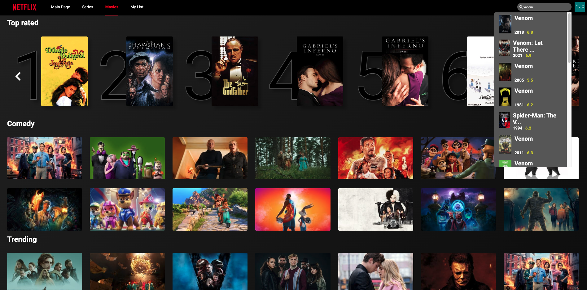
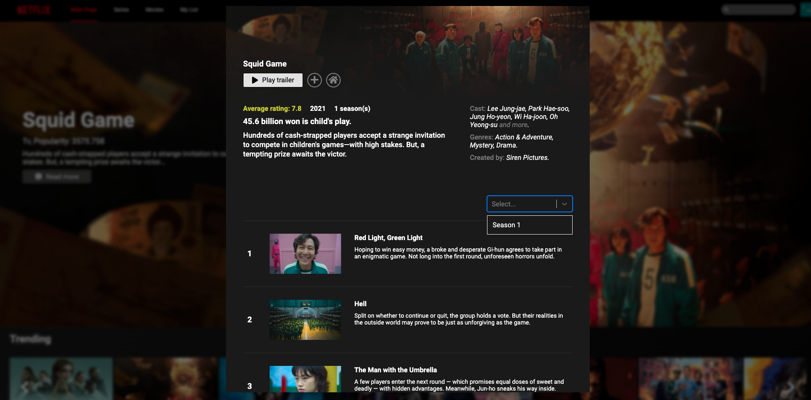
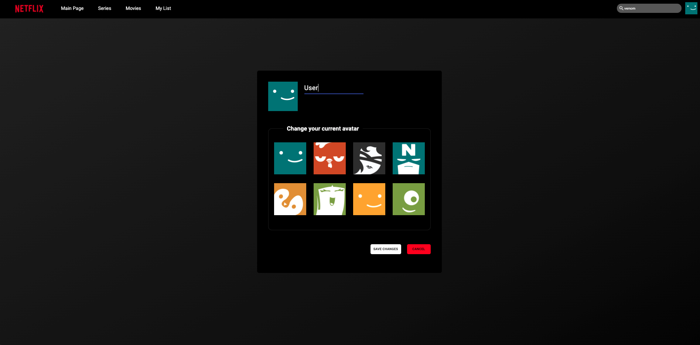

# Netflix-clone App
> Project focused on building simplified version of Netflix web app.
> Live demo [_here_](https://netflix-clone-2.herokuapp.com).\
> To save your time log in to the app with this data:\
> login: example@example.com\
> password: Example1234\
> (App is hosted on Heroku so it has cold start. If error occurs just refresh the page and the app will be running). <!-- If you have the project hosted somewhere, include the link here. -->

## Technologies Used
- React 17.0.1
- Redux 4.0.5
- Firebase 8.3.0
- Axios 0.21.1
- Formik 2.2.6
- Lodash 4.17.21
- MaterialUI 4.11.3

## Features
- User authentication
- Browsing latest movies and TV shows and adding them to 'Your List'
- Account settings

## Screenshots
<!--  -->

  
   

Login view and users view.

Main page view.

 

Movies page view.

 

Modal which contains details about specific movie or TV show.

 

Account settings view

 

